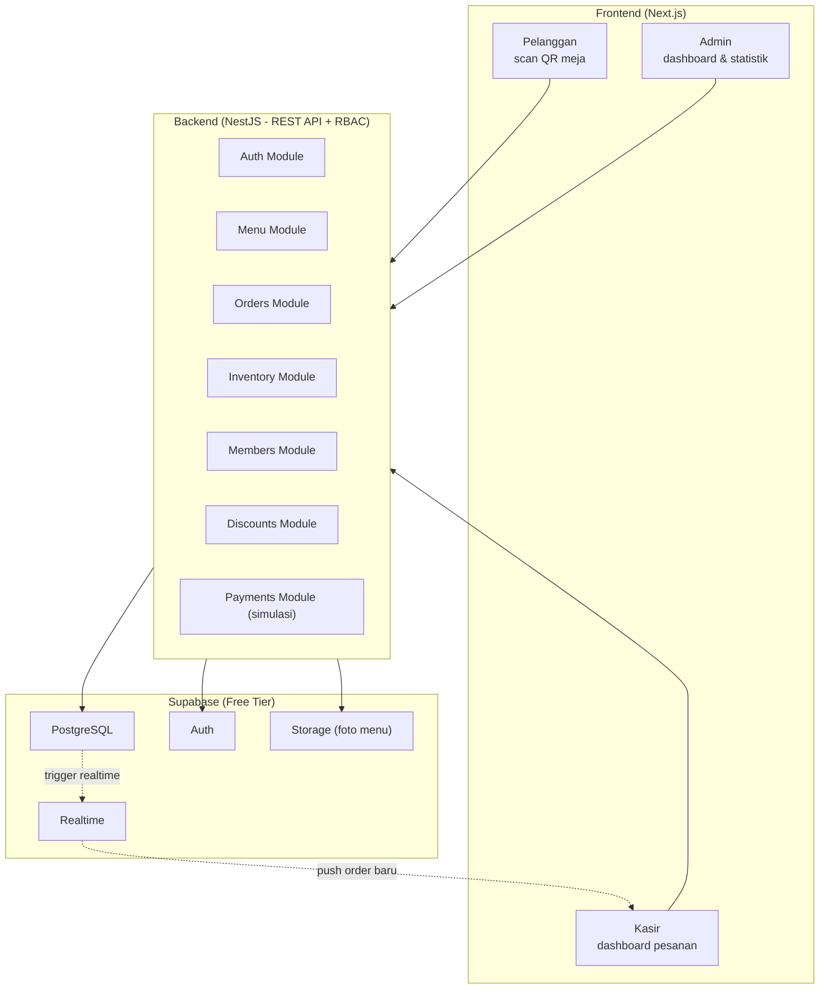

# PRD Cafe Ordering System

## Overview

<aside>
☕

Dokumen ini adalah **Product Requirements Document (PRD)** untuk sistem pemesanan cafe berbasis web dengan 3 role: **Admin**, **Kasir**, dan **Pelanggan**. Alur intinya: pelanggan scan QR meja → pesan menu → pesanan masuk ke kasir secara real-time dengan nomor meja → kasir konfirmasi → masuk history.

</aside>

**Pendekatan & keputusan utama yang sudah dikunci:**

Arsitektur memisahkan **frontend dan backend** dalam repo/branch terpisah dengan deployment terpisah, sesuai keinginanmu. Frontend pakai **Next.js (React)**, backend pakai **NestJS** modular (satu monolith dengan RBAC, *bukan* 3 backend terpisah agar tidak over-engineering), dan **Supabase** sebagai PostgreSQL + Auth + Realtime.

Untuk real-time pesanan ke kasir, kita andalkan **Supabase Realtime** (subscribe ke perubahan tabel `orders`) sehingga backend NestJS cukup melayani REST API biasa — ini aman dijalankan sebagai **Vercel serverless function**. Strategi rilis: **local dulu**, lalu deploy frontend & backend terpisah ke Vercel, dengan database di Supabase (semua free tier).

Pembayaran (QRIS / transfer bank) dibuat sebagai **simulasi** terlebih dahulu — UI dan flow lengkap, tapi tanpa integrasi payment gateway asli.

## Your Preferences

**Tech stack (sudah dikonfirmasi):**

- **Frontend:** Next.js (React) — mobile-friendly untuk scan QR di HP
- **Backend:** NestJS (TypeScript, modular, RBAC)
- **Database:** Supabase (PostgreSQL)
- **Auth:** Supabase Auth (bawaan)
- **Real-time:** Supabase Realtime (subscribe perubahan tabel `orders`)
- **Deployment:** Frontend & backend terpisah di Vercel (serverless) + Supabase Realtime

**Konvensi & arsitektur:**

- Frontend dan backend di **repo/branch GitHub terpisah**, deployment terpisah
- **Local development dulu**, baru deploy ke cloud (semua free tier)
- Backend **satu monolith modular** dengan role-based access control — bukan microservices per role
- Pembayaran **simulasi** dulu (QRIS & transfer bank), belum integrasi gateway asli
- Pelanggan bisa memesan **tanpa akun**; diskon hanya berlaku untuk **member yang login** saat ada event

## Implementation Plan

### Step 1: 1. Tujuan & Ruang Lingkup

**Tujuan produk:** Membangun sistem pemesanan cafe end-to-end di mana pelanggan memesan via scan QR di meja, kasir memproses pesanan secara real-time, dan admin mengelola menu, stok, member, diskon, serta memantau statistik penjualan.

**Dalam ruang lingkup (in-scope):**

- [ ]  Pemesanan berbasis QR meja (tanpa wajib akun)
- [ ]  Sistem member + login (Supabase Auth) untuk dapat diskon
- [ ]  Dashboard kasir real-time (waiting list + history)
- [ ]  Dashboard admin (stok, statistik, event diskon, member)
- [ ]  Simulasi pembayaran QRIS & transfer bank

**Di luar ruang lingkup (out-of-scope, tahap awal):**

- Integrasi payment gateway asli (Midtrans/Xendit) — hanya simulasi
- Aplikasi mobile native (cukup web responsive)
- Multi-cabang cafe (fokus 1 cafe dulu)
- Sistem dapur (kitchen display) terpisah

### Step 2: 2. User Roles & Hak Akses (RBAC)

Tiga role dengan hak akses berbeda, dikontrol via middleware di NestJS:

| Role | Akses Utama | Login? |
| --- | --- | --- |
| **Admin** | Kelola menu, stok, member, event diskon, lihat statistik penjualan | Wajib login |
| **Kasir** | Lihat & konfirmasi pesanan, lihat history pesanan | Wajib login |
| **Pelanggan** | Scan QR, lihat menu, pesan, bayar (simulasi) | Opsional (member untuk diskon) |

<aside>
🔐

Pelanggan **tidak wajib** punya akun untuk memesan. Akun member hanya dibutuhkan agar harga terpotong otomatis saat ada **event diskon** aktif.

</aside>

### Step 3: 3. Fitur Detail per Role

- 👑 Admin
    - **Manajemen stok:** tambah / kurang / pantau stok tiap menu, lihat menu yang hampir habis
    - **Statistik penjualan:** total penjualan **harian, mingguan, bulanan** (grafik + angka)
    - **Event diskon:** buat event diskon untuk **sebagian atau semua menu**, atur periode aktif & besaran diskon, hanya berlaku untuk **member**
    - **Manajemen member:** pantau daftar member & aktivitasnya
    - **Manajemen menu:** CRUD menu (nama, harga, kategori, foto, ketersediaan)
- 🧾 Kasir
    - **Terima pesanan** dari pelanggan secara real-time (muncul otomatis dengan **nomor meja**)
    - **Waiting list:** daftar pesanan yang **belum dikonfirmasi**
    - **Konfirmasi pesanan:** setelah dikonfirmasi → hilang dari waiting list → masuk **history pesanan**
    - **History:** daftar semua pesanan yang sudah dikonfirmasi
- 🙋 Pelanggan
    - **Scan QR meja** → otomatis masuk web & **tercatat di meja nomor berapa**
    - **Lihat menu & pesan** tanpa harus buat akun
    - **Login member** (opsional) → saat ada event diskon, harga menu yang didiskon **otomatis terpotong**
    - **Checkout & pembayaran** simulasi (QRIS / transfer bank)
    - Pesanan terkirim ke kasir lengkap dengan **nomor meja**

### Step 4: 4. Alur Sistem (User Flow)

**Alur pemesanan utama:**

1. Pelanggan **scan QR** di meja → buka web, `table_number` tersimpan di sesi
2. (Opsional) Pelanggan **login sebagai member**
3. Pelanggan pilih menu → masuk keranjang
4. Jika member & ada event diskon aktif → **harga terpotong otomatis**
5. Pelanggan checkout → pilih metode bayar (QRIS / transfer — **simulasi**)
6. Pesanan tersimpan dengan status `waiting` + nomor meja
7. **Supabase Realtime** push pesanan baru → muncul di **dashboard kasir**
8. Kasir **konfirmasi** → status jadi `confirmed` → pindah ke history

<aside>
⚡

Real-time dicapai dengan kasir men-*subscribe* perubahan tabel `orders` lewat Supabase Realtime — tanpa perlu server WebSocket sendiri.

</aside>

### Step 5: 5. Skema Database (Supabase / PostgreSQL)

Rancangan tabel utama:

```sql
-- Profil & role (terhubung ke Supabase Auth)
profiles      (id, auth_user_id, name, role, points, created_at)

-- Meja & QR
tables        (id, table_number, qr_token, is_active)

-- Menu
categories    (id, name)
menu_items    (id, name, description, price, category_id, image_url, stock, is_available)

-- Pesanan
orders        (id, table_id, member_id?, status, subtotal, discount_total, grand_total, created_at, confirmed_at, confirmed_by)
order_items   (id, order_id, menu_item_id, qty, unit_price, discount_amount)

-- Diskon
discount_events      (id, name, type, value, start_at, end_at, is_active, applies_to_all)
discount_event_items (id, event_id, menu_item_id)

-- Stok
inventory_logs (id, menu_item_id, change_qty, reason, created_by, created_at)

-- Pembayaran (simulasi)
payments      (id, order_id, method, amount, status, created_at)
```

<aside>
📝

`status` order: `waiting` → `confirmed`. `payments.status`: `pending` → `paid` (disimulasikan). `role`: `admin` / `kasir` / `member`.

</aside>

### Step 6: 6. Arsitektur Backend & Struktur API

Backend **NestJS** sebagai **modular monolith** dengan RBAC. Struktur modul:

```
backend/src/
 ├─ auth/        → login, register, guard role
 ├─ menu/        → CRUD menu & kategori
 ├─ orders/      → buat pesanan, konfirmasi, history
 ├─ inventory/   → stok masuk/keluar, log
 ├─ members/     → data & pantau member
 ├─ discounts/   → event diskon
 └─ payments/    → simulasi QRIS/transfer
```

**Contoh endpoint:**

| Method | Endpoint | Role |
| --- | --- | --- |
| POST | `/orders` | Public (pelanggan) |
| GET | `/orders?status=waiting` | Kasir |
| PATCH | `/orders/:id/confirm` | Kasir |
| GET | `/menu` | Public |
| POST/PATCH | `/menu` | Admin |
| POST | `/inventory/adjust` | Admin |
| GET | `/stats/sales?range=daily` | Admin |
| POST | `/discounts` | Admin |
| POST | `/payments/simulate` | Public |

Setiap endpoint sensitif dilindungi **role guard** sesuai tabel di atas.

### Step 7: 7. Strategi Git & Deployment

**Pemisahan repo/branch (sesuai keinginanmu):**

- **Frontend** dan **backend** di repo/branch terpisah
- Deployment terpisah sehingga bisa di-update independen

**Tahapan deployment:**

1. **Local development**
    - Frontend: `localhost:3000` (Next.js)
    - Backend: `localhost:4000` (NestJS)
    - Database: project Supabase (cloud, free) atau Supabase local
2. **Cloud (free tier)**
    - Frontend → **Vercel**
    - Backend → **Vercel serverless** (NestJS via serverless adapter)
    - Database/Auth/Realtime → **Supabase**

<aside>
💡

Karena real-time ditangani Supabase, backend NestJS cukup REST API stateless — cocok berjalan sebagai Vercel serverless function. Kalau nanti butuh proses long-running, backend bisa dipindah ke Render/Railway tanpa ubah frontend.

</aside>

**Variabel environment** (Supabase URL, anon key, service role key) disimpan terpisah per environment (`.env.local` vs Vercel env vars).

### Step 8: 8. Roadmap / Milestone Pengembangan

Saran urutan pengerjaan bertahap:

- [ ]  **Fase 1 — Fondasi:** setup repo frontend & backend, koneksi Supabase, skema DB, auth & role
- [ ]  **Fase 2 — Menu & QR:** CRUD menu, generate QR meja, halaman scan → tercatat nomor meja
- [ ]  **Fase 3 — Pemesanan:** keranjang, buat order, kirim ke kasir via Realtime
- [ ]  **Fase 4 — Kasir:** dashboard waiting list + konfirmasi + history
- [ ]  **Fase 5 — Member & Diskon:** login member, event diskon, potong harga otomatis
- [ ]  **Fase 6 — Admin:** manajemen stok, statistik penjualan (harian/mingguan/bulanan)
- [ ]  **Fase 7 — Pembayaran:** simulasi QRIS & transfer bank
- [ ]  **Fase 8 — Deploy:** rilis ke Vercel + Supabase, uji end-to-end

<aside>
🚀

MVP minimal = Fase 1–4 (pelanggan bisa pesan, kasir bisa proses). Fitur member/diskon/admin/pembayaran menyusul.

</aside>

## Architecture

